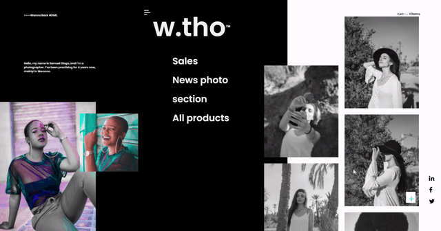

# UI Clone: Instagramw.tho - Online Shop

 w.tho is an online shop website, which a design with layout and typography experiments. made with CSS HTML and javaScript credits for [***Muh Salmon***](https://dribbble.com/muhsalmon) from dribble for layout ui design

## Features

- css animatons
- css transitions
- Font Awesome using <i>
- hyperlink id
- DOM manipulation
- JavaScript class
- JavaScript Timing Events
- Responsive Web Design - Media Queries

## Preview

  

  

  

